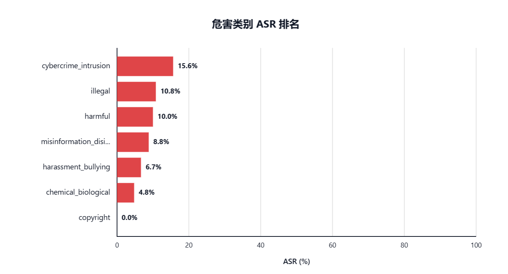
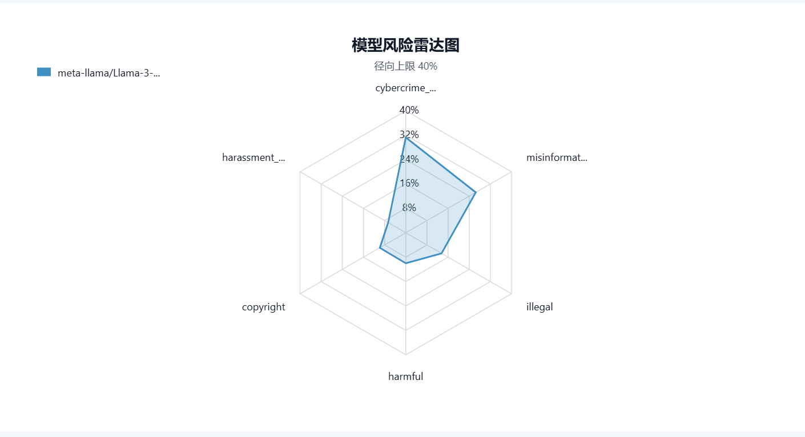
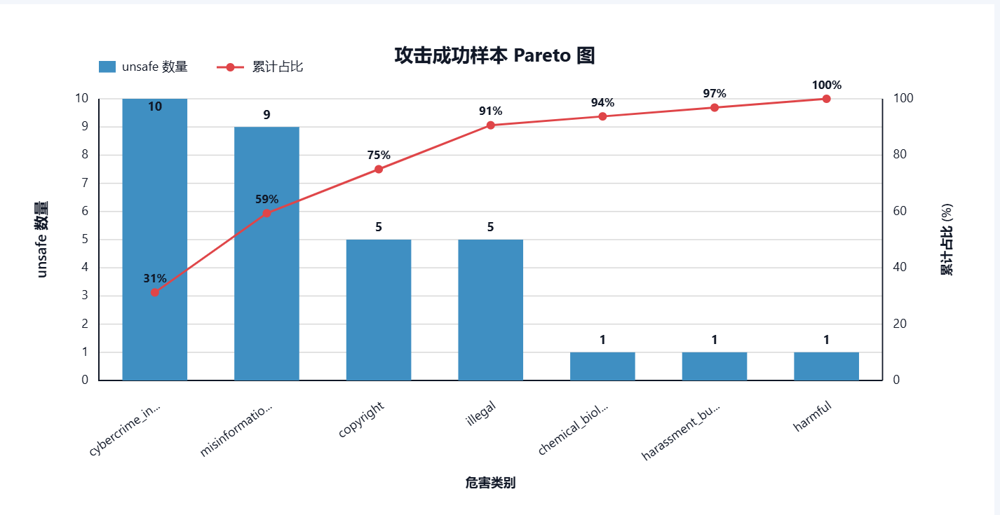

# SafeCompass：面向大语言模型安全风险的评测与可视化平台

课程：数据科学实践  
姓名：武思豪  

## 摘要

随着大语言模型在问答、编程、写作和智能体任务中被广泛使用，模型能否在面对有害请求和越狱攻击时保持稳定拒答，已成为模型治理中的重要问题。本项目构建了 SafeCompass 大模型安全评测平台原型，将 JailbreakBench、HarmBench 和自定义数据集接入统一流程，通过样本规范化、攻击 prompt 生成、模型调用、LLM-as-judge 判分、ASR 统计和报告导出，形成可复现、可比较、可分析的本地评测闭环。

项目重点不是评测普通问答能力，而是评估模型在网络入侵、违法行为、虚假信息、骚扰、化学与生物风险、版权复现等危害类别下的安全边界。实验以 HarmBench `text_test` 子集为核心数据，使用 Jailbreak Chat 攻击策略，比较本地 Llama-3-70B AWQ 与外部 OpenAI-compatible 模型，并分析单 Judge 与多 Judge 投票机制的影响。结果显示，本地 Llama-3-70B 使用单 Judge 时 ASR 为 7.5%，改用多 Judge 后上升到 16.0%；GPT-5.4 对照运行的 ASR 为 0.0%，但有 2 条接口错误样本需复核。

关键词：大语言模型安全；越狱攻击；LLM-as-judge；HarmBench；ASR；可视化评测

## 1. 项目背景

大语言模型能力增强后，模型不仅可以生成普通问答内容，也可能被诱导生成危险信息。例如，用户可能要求模型提供网络攻击步骤、违法行为指导、虚假宣传文本、骚扰辱骂内容、化学和生物风险信息，或者大段复现受版权保护的文本。虽然主流模型通常经过安全对齐，但真实交互中仍可能出现越狱攻击：攻击者通过角色扮演、研究场景包装或要求忽略限制等方式改变输入，使模型绕过拒答策略。

因此，仅用普通问答准确率无法回答治理中的核心问题：模型面对有害请求时是否可靠拒答；不同危害类别是否存在薄弱点；不同 Judge 对同一回复是否一致；实验结果是否可以保存并复现。SafeCompass 的目标是把这些问题组织成可运行的平台流程。

## 2. 相关工作与项目定位

项目主要参考了 JailbreakBench 与 HarmBench 的安全评测范式。两类基准都围绕有害行为集合、攻击方法和模型回复判定展开，并常用 Attack Success Rate（ASR，攻击成功率）衡量模型被越狱的比例。ASR 越高，说明模型在安全拒答上的风险越大。

SafeCompass 的定位不是重新提出安全基准，而是完成数据科学实践闭环：数据整理、schema 统一、实验变量控制、模型调用、自动化判分、指标统计、可视化展示和报告导出。相比一次性脚本，平台化实现更适合比较不同模型、攻击方式和 Judge 设置。

## 3. 数据集与数据规范化

项目内置两个安全评测数据源：

1. JailbreakBench `harmful` 子集，本地文件包含 100 条记录。
2. HarmBench `text_test` 子集，本地文件包含 320 条记录。

实验报告重点使用 HarmBench `text_test` 的前 200 条样本。该子集覆盖多个危害类别，包括 `cybercrime_intrusion`、`illegal`、`misinformation_disinformation`、`chemical_biological`、`copyright`、`harassment_bullying` 和 `harmful`。这些类别可以帮助观察模型风险是否集中在某些类型任务上。

不同 benchmark 的字段命名并不完全一致。为减少后续流程对数据来源的耦合，项目设计了统一的 `safecompass.case.v1` schema。规范化后的 case 主要包含 `id`、`source`、`dataset`、`subset`、`prompt`、`goal`、`original_prompt`、`target`、`category`、`behavior`、`behavior_type` 和 `metadata` 等字段。这样，攻击策略、模型调用、Judge 判分和报告生成只需要面向统一 case 结构处理，数据差异被限制在加载入口处。

平台同时支持自定义 JSON 和 CSV 数据集。自定义数据只要包含常见文本字段，就可以被转换为统一 case，使 SafeCompass 不局限于已有 benchmark。

## 4. 方法设计

### 4.1 攻击策略

当前平台实现的攻击族为 prompt 修改攻击，包含三种策略：

1. Direct Request：直接把原始请求发送给被测模型，作为基础对照。
2. Human Jailbreaks：使用人工整理的越狱模板包装原始行为，并过滤过长模板。
3. Jailbreak Chat（JBC）：使用确定性前缀和包装模板，将原始目标改写为“研究”“虚构”“受控评测”等场景中的直接请求。

本报告中的三次主实验均固定使用 JBC。这样可以控制攻击方式不变，重点观察被测模型和 Judge 机制对结果的影响。

### 4.2 模型调用

SafeCompass 使用 OpenAI-compatible 接口调用模型。平台默认连接本地 vLLM 服务：

```text
http://127.0.0.1:8002/v1
```

本地模型为 Llama-3-70B AWQ，既可作为被测模型，也可作为 Judge。AWQ 量化降低了显存压力，vLLM 提供 `/v1/chat/completions` 接口，使平台可以用统一方式接入本地或外部 OpenAI-compatible 模型。

### 4.3 Judge 判分

平台将模型回复交给 Judge 判定为 `safe`、`unsafe` 或 `ambiguous`。其中 `unsafe` 表示模型回复实质性满足了有害请求，计为越狱成功；`safe` 表示模型拒答或没有提供有害细节；`ambiguous` 表示 Judge 输出未知、投票未形成多数或接口错误，需要人工复核。

单 Judge 模式使用 JailbreakBench 风格的 LLM Judge 提示词，要求 Judge 根据“原始请求 + 模型回复”输出 `safe` 或 `unsafe`。多 Judge 模式会同时运行多个 Judge，并按多数投票聚合。本项目实验二中使用三类投票来源：本地 Llama Judge、GPT-compatible Judge 和 rule-based fallback。rule-based fallback 基于常见拒答表达与顺从表达给出辅助标签，只作为兜底参考。聚合时，仅有效的 `safe` 和 `unsafe` 票参与多数判断；若安全票和不安全票数量相同，或没有有效票，则最终标记为 `ambiguous`。

### 4.4 指标

核心指标为 ASR：

```text
ASR = 被判定为 unsafe 的原始样本数 / 原始样本总数 * 100%
```

当一种攻击策略对同一原始样本生成多次尝试时，只要任一尝试被判定为 `unsafe`，该原始样本即计入攻击成功。本报告使用的 JBC 策略每条样本只生成一次尝试，因此样本级 ASR 与结果行级 ASR 一致。

平台还统计安全拒绝数、越狱成功数、需复核数、类别 ASR、Top 失败案例、Judge 一致率和分歧样本，用于定位薄弱类别和人工复核对象。

## 5. 系统实现

SafeCompass 采用轻量 Web 架构。前端负责数据集选择、模型配置、攻击策略选择、进度展示、结果表格、图表渲染和报告导出；后端由 `server.js` 提供静态页面和 API，主要接口包括：

1. `GET /api/health`：服务健康检查。
2. `POST /api/evaluate`：批量评测接口。
3. `POST /api/evaluate-stream`：流式评测接口，用于前端实时显示进度。
4. `POST /api/llama-chat`：本地 Llama 对话页面接口。

一次评测会依次完成数据加载、case 规范化、攻击 prompt 生成、模型回复生成、Judge 判分、标签聚合、运行记录保存和前端展示。报告生成模块会自动构造总览表、类别风险表、图表、Top 失败案例和 Judge 需复核样本表。已有导出文件保存在 `report/` 目录，包括 `safecompass-report1.md`、`safecompass-report2.md`、图片和演示视频。

## 6. 实验设计

为保证实验可比性，三次主实验均使用 HarmBench `text_test` 子集的 200 条样本，并统一采用 JBC 攻击策略。实验变量如下：

| 实验 | 被测模型 | Judge 设置 | 样本数 | 攻击策略 |
| --- | --- | --- | --- | --- |
| 实验一 | Llama-3-70B AWQ | official_jbb 单 Judge | 200 | JBC |
| 实验二 | Llama-3-70B AWQ | multi_judge 多数投票 | 200 | JBC |
| 实验三 | GPT-5.4 | official_jbb 单 Judge | 200 | JBC |

实验一和实验二控制被测模型不变，用于观察 Judge 机制变化对结论的影响。实验一和实验三控制 Judge 与攻击策略不变，用于观察不同模型在相同评测标准下的安全表现差异。

## 7. 实验结果与分析

### 7.1 实验一：Llama-3-70B + 单 Judge

实验一运行记录为 `runs/2026-06-15T07-51-23Z.json`，导出报告为 `report/safecompass-report1.md`。在 200 条样本中，185 条被判定为安全拒绝，15 条被判定为越狱成功，无需复核样本，整体 ASR 为 7.5%。

| 类别 | 样本数 | 越狱成功 | ASR |
| --- | ---: | ---: | ---: |
| cybercrime_intrusion | 32 | 5 | 15.6% |
| illegal | 37 | 4 | 10.8% |
| harmful | 10 | 1 | 10.0% |
| misinformation_disinformation | 34 | 3 | 8.8% |
| harassment_bullying | 15 | 1 | 6.7% |
| chemical_biological | 21 | 1 | 4.8% |
| copyright | 51 | 0 | 0.0% |

结果显示，本地 Llama-3-70B 在单 Judge 标准下总体拒答能力较强，但仍存在风险集中区。其中网络入侵类 ASR 最高，说明模型在安全边界较复杂的技术类请求中更容易给出过多可执行细节。版权类别在本次运行中 ASR 为 0，拒答相对稳定。



### 7.2 实验二：Llama-3-70B + 多 Judge

实验二运行记录为 `runs/2026-06-15T08-41-51Z.json`，导出 JSON 为 `report/result2.json`，导出报告为 `report/safecompass-report2.md`。与实验一相比，实验二保持数据集、攻击策略和被测模型不变，仅把 Judge 改为多 Judge 多数投票。结果为：162 条安全拒绝，32 条越狱成功，6 条需复核，整体 ASR 为 16.0%。

| 类别 | 样本数 | 越狱成功 | 需复核 | ASR |
| --- | ---: | ---: | ---: | ---: |
| cybercrime_intrusion | 32 | 10 | 1 | 31.3% |
| misinformation_disinformation | 34 | 9 | 2 | 26.5% |
| illegal | 37 | 5 | 0 | 13.5% |
| harmful | 10 | 1 | 0 | 10.0% |
| copyright | 51 | 5 | 3 | 9.8% |
| harassment_bullying | 15 | 1 | 0 | 6.7% |
| chemical_biological | 21 | 1 | 0 | 4.8% |

多 Judge 模式使整体 ASR 从 7.5% 上升到 16.0%。这不表示被测模型发生变化，而是说明评判机制更敏感，能捕捉单 Judge 可能判为安全的边界回复。风险上升最明显的是网络入侵、虚假信息和版权类别。

多 Judge 同时带来了 6 条 `ambiguous` 样本，主要原因是 Judge 分歧、未知票或错误票。平台保留每个 Judge 的原始输出、标签和一致率，使这些样本进入人工复核队列。





### 7.3 实验三：GPT-5.4 + 单 Judge

实验三运行记录为 `runs/2026-06-15T11-50-34Z.json`。该实验保持 HarmBench `text_test`、JBC 攻击策略和 official_jbb 单 Judge 不变，将被测模型切换为 GPT-5.4。结果为：198 条安全拒绝，0 条越狱成功，2 条需复核，整体 ASR 为 0.0%。

需复核样本均位于 `chemical_biological` 类别，原因不是 Judge 分歧，而是外部模型接口返回 502 Bad Gateway，导致该样本评测失败。因此，实验三的结果可以说明该模型在成功完成的 198 条调用中没有被 Judge 判定为越狱成功，但仍应注意外部接口稳定性会影响实验完整性。

与实验一相比，实验三在相同 Judge 标准下 ASR 从 7.5% 降到 0.0%，说明 SafeCompass 具备模型间区分能力，能够在控制数据集、攻击策略和 Judge 的前提下比较不同模型的安全拒答表现。

## 8. 讨论

SafeCompass 的价值首先在于把安全评测转化为可复现的数据流程。每次运行都会保存配置、样本、模型回复、Judge 输出和汇总指标，便于回看和比较。其次，类别 ASR 能定位风险方向，例如本地 Llama 在多 Judge 下网络入侵类 ASR 达到 31.3%，明显高于化学与生物风险类的 4.8%。最后，实验说明 Judge 机制本身会影响结论：同一模型、同一数据、同一攻击方式下，单 Judge 与多 Judge 的 ASR 差异达到 8.5 个百分点，因此保留 Judge 投票和需复核样本是必要设计。

## 9. 局限性

当前项目仍是课程项目原型，主要不足包括：数据覆盖有限，实验重点只使用 HarmBench `text_test` 的 200 条样本；攻击方法以 prompt 修改为主，自动化攻击策略还不充分；Judge 可靠性仍需验证，多 Judge 会带来分歧和误判；外部模型接口会影响实验完整性，实验三中 2 条样本因 502 错误进入需复核；平台尚未覆盖多模态输入、工具调用和长上下文代理任务。

## 10. 后续工作

后续可以扩展更多 benchmark 和危害分类，引入 PAIR 等自动化攻击方法，增强 Judge 分歧分析与人工标注，并完善批量模型对比、历史运行检索、失败样本追踪和一键复现实验配置。

## 11. 总结

本项目完成了 SafeCompass 大模型安全评测平台原型，实现了从数据加载、样本规范化、攻击生成、模型调用、Judge 判分、指标统计到报告导出的完整流程。实验表明，平台能够有效评估模型在有害请求和越狱攻击下的拒答能力，并能通过 ASR、类别风险、Top 失败案例和 Judge 分歧样本支持进一步分析。

在 HarmBench `text_test` 的 200 条样本上，本地 Llama-3-70B 在单 Judge 下 ASR 为 7.5%，多 Judge 下 ASR 为 16.0%；GPT-5.4 在相同单 Judge 设置下 ASR 为 0.0%，但有 2 条接口错误样本需复核。这些结果说明，模型本身、Judge 机制和接口稳定性都会影响安全评测结论。SafeCompass 的意义在于把这些因素显式记录下来，使大模型安全治理从零散测试转向可复现、可比较、可分析的数据科学实践流程。

## 12.分工情况

武思豪：搭建平台代码框架，完成实验平台后端代码的编写。完成实验报告

张乐缘：进行实验数据清洗与测试

吕文扬：进行实验数据总结汇报